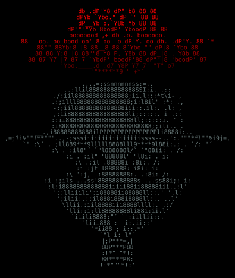

---

 <i>“A good day boils down to spending 10 hours automating a task that can be done manually in 10 minutes.”</i> 

---

## About Me

CS graduate @ [FCUP](https://www.fc.up.pt/)

My favourite programming language is Haskell, in spite of having to perform some esoteric math ritual every time I want to use a different monad; -- Any sufficiently advanced Haskell program is indistinguishable from magic

Other than Haskell, I also know how to fill a screen with error messages in: `C`, `Python`, `C++`, `Java`, `Scala`, `JavaScript`, `Node.js`;

As for *non-programming* languages, I speak: native Portuguese; fluent English; basic Spanish; and am learning French;

I like to draw in ASCII in my free time, as such, here's a **completely necessary** demonstration of my artistic talent:

  

<!--
<pre style="font-family:monospace;font-size:10px;line-height:1.02;white-space:pre;background-color:#000;color:#677;padding:8px;margin-left:20%;margin-right:20%;text-align:center" align="center">
                  db    .dP"Y8  dP""b8 88 88                   
                 dPYb   `Ybo." dP   `" 88 88                   
                dP__Yb  o.`Y8b Yb      88 88                   
               dP""""Yb 8bodP'  YboodP 88 88                   
oooooood               ,+        db               .o. boooooo. 
88__   oo. oo bood oo' 8 oo'  o.dP"Y. oo    db. .dP"Y.   88  `*
88""   88Yb:8  |8  88__8 88   8`Ybo   ""   dP|8 `Ybo     88    
88     88 Y:8  |8  88""8 Y8   P.  Y8b 88  dP_|8 .  Y8b   88    
88     87  Y7  |7  87  7 `YbdP''boodP'88 dP""|8 'boodP'  87    
'Ybo.____.d      .d7             Y8P  Y7     7'   "T"   o7     
  ""******9                       "                   +*´      
                                                               
                    _,,..=:ssnnnnnnss:=.._                     
               ..:llil8888888888888SSI:i. .::                  
            ./:iil888888888888888;ii.l:::*t\i- ,               
          .:;illl888888888888888;i:l8il'  :*:  .,              
          -:;iil88888888888888iii::.il:.    .l:  ,             
         ,:ii88888888888888888li;:::::.     i .::              
         ::ii8888888888888888888ll;:::::i.   '      :          
         :i88888888888888888888888888;;ili..       .           
    __.,i88888888888ilPPPPPPPPPPPPPPPPli8888i:..  _            
,=j?i%""!**"""..,-;sssiiiiiiiiiiiiiiiissss--..':."""**!""%i9j=,
`"    :\´  .  ;ll889***9lllll8888lll9****9l88i:.;  .  `/:    "´
      :\   . :il8"´      `"l888888l/`      `"88ii: .   /:      
       :i  . :il"          "88888l"          "l8i: .  i:       
        :\  .:il           .88888i            :8i:.  /:        
         :i  :jt           l888888:           i8i:  i:         
          :\ ':j,_        :88888888:.       .:8i:  /:          
           :i :;ils-...ss!88888888888s-...ss88i;: i:           
            :l:i8888888888888iiiii88ii88888iii..:l'            
             ';:lliiili':i88888ii88888ll::.'  '.l:             
              ';ilii:.::il888i888i8888ll:..  ..l'              
                \llii.:iil8888iii8888llll:. .:/                
                 'lli::i:ll88888888li88i:ii.l'                 
                  `iiili8888:"´ `":iillii::.                   
                    "liii888':    'i:.ii::´                    
                      `*ii88 ;     i::.*'                      
                         `"l i:    l"´                         
                           |;P***=,|                           
                           88P***P88                           
                           :!*"""*!:                           
                           88****P8:                           
                          !i*"""*!:'                           
</pre>
-->

## Currently

- Mentally preparing to close Vim

- Re-reading The Hobbit

- making plans that either come to naught or half a page of scribbled lines <!-- +1 point if you caught that reference -->
